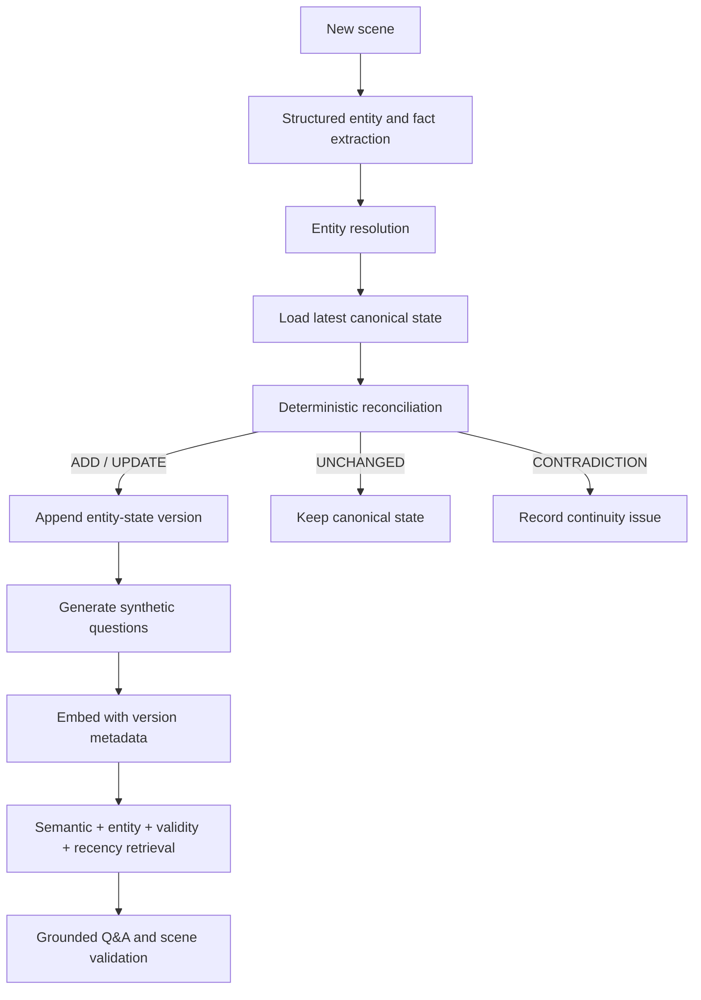

# ArcLedger

ArcLedger is a stateful narrative intelligence engine for long-form fiction. It turns scenes into explicit, versioned entity memory; retrieves the newest canonical knowledge through synthetic questions; flags continuity breaks before they overwrite canon; and answers story questions with source references.

The name reflects the core architecture: every story arc is maintained as an auditable, append-only ledger of facts and state transitions—not a regenerated summary and not a generic chatbot.

## Why it exists

Long stories accumulate state: injuries persist, possessions move, relationships change, and characters learn things they cannot later forget without explanation. Chunk-only RAG often retrieves a semantically similar but obsolete passage. ArcLedger models narrative state directly and makes version validity a first-class retrieval signal.

## Processing architecture



The application separates orchestration from focused services:

- `EntityExtractionService` calls a configured `LanguageModelClient` and deserializes structured JSON.
- `EntityResolutionService` maintains story-scoped entity identity.
- `EntityStateService` reads the active canonical facts.
- `StateReconciliationService` deterministically classifies `ADD`, `UPDATE`, `UNCHANGED`, and `CONTRADICTION`.
- `EntityStateVersionService` appends immutable snapshots and supersedes old facts without deleting them.
- `SyntheticQuestionGenerationService` creates multiple retrieval surfaces for each valid state.
- `NarrativeVectorStore` retains story, entity, version, scene, timestamp, and current/obsolete metadata.
- `NarrativeRetrievalService` filters obsolete state and makes ranking weights explicit.
- `ConsistencyValidationService` catches cross-fact continuity breaks such as two-handed actions after an arm loss.
- `NarrativeQuestionAnsweringService` returns grounded answers and source identifiers, or `INSUFFICIENT_CONTEXT`.

## Stateful RAG concepts demonstrated

| Concern | ArcLedger approach |
| --- | --- |
| Incremental memory | Atomic facts are added or explicitly updated per scene. |
| Versioned knowledge | Every accepted mutation creates an immutable state snapshot. |
| Superseding | Replaced facts remain in history and point to their replacement. |
| Synthetic-query retrieval | Natural questions, rather than raw chunks alone, are embedded. |
| Dense retrieval | A deterministic local embedding adapter provides a zero-secret baseline. |
| Metadata-aware ranking | Story/entity filters, version validity, and scene provenance are retained. |
| Recency awareness | Current-state and time-decay signals are explicit in scoring. |
| Hallucination control | Only `FACT` knowledge mutates canon; `INFERENCE` and `UNKNOWN` do not. |
| Plot-hole detection | Contradictions are persisted as structured results with evidence. |
| Grounded generation | Answers use current canonical hits and include source scene/version IDs. |

## Technology

- Java 17+
- Spring Boot 3.3
- Spring Web, Validation, Data JPA
- H2 for a low-infrastructure local store
- Pluggable LLM and embedding interfaces
- JUnit 5, AssertJ, Mockito, MockMvc

No API key is required for the built-in deterministic provider. For real model-backed extraction, the optional OpenAI Responses adapter uses JSON output through the provider-neutral `LanguageModelClient` boundary. See the [official Responses API documentation](https://platform.openai.com/docs/api-reference/responses).

## Run locally

```bash
git clone <repository-url>
cd arc-ledger
cp .env.example .env
set -a && source .env && set +a
mvn spring-boot:run
```

The default in-memory database is useful for quick evaluation. Loading `.env` switches to a persistent H2 file under `data/`, which is ignored by Git.

To enable model-backed extraction:

```bash
export ARCLEDGER_LLM_PROVIDER=openai
export OPENAI_API_KEY='your-key'
export ARCLEDGER_LLM_MODEL='gpt-4.1-mini'
mvn spring-boot:run
```

Prompt templates live in `src/main/resources/prompts/`; long prompts are not scattered through service classes.

## API walkthrough

Create a story:

```bash
curl -sS -X POST http://localhost:8080/stories \
  -H 'Content-Type: application/json' \
  -d '{"title":"The Last Meridian","description":"A city at the edge of time"}'
```

Create a chapter using the returned story ID:

```bash
curl -sS -X POST http://localhost:8080/stories/$STORY_ID/chapters \
  -H 'Content-Type: application/json' \
  -d '{"number":1,"title":"The Siege"}'
```

Submit scenes. Processing is automatic:

```bash
curl -sS -X POST http://localhost:8080/stories/$STORY_ID/chapters/$CHAPTER_ID/scenes \
  -H 'Content-Type: application/json' \
  -d '{"sequence":1,"rawText":"John has black hair. John is in London."}'

curl -sS -X POST http://localhost:8080/stories/$STORY_ID/chapters/$CHAPTER_ID/scenes \
  -H 'Content-Type: application/json' \
  -d '{"sequence":2,"rawText":"John loses his left arm during the battle."}'
```

Inspect memory and history:

```bash
curl -sS http://localhost:8080/stories/$STORY_ID/entities
curl -sS http://localhost:8080/stories/$STORY_ID/entities/$ENTITY_ID
curl -sS http://localhost:8080/stories/$STORY_ID/entities/$ENTITY_ID/history
```

Submit a suspicious scene and inspect its result:

```bash
curl -sS -X POST http://localhost:8080/stories/$STORY_ID/chapters/$CHAPTER_ID/scenes \
  -H 'Content-Type: application/json' \
  -d '{"sequence":3,"rawText":"John holds one sword in each hand."}'

curl -sS http://localhost:8080/stories/$STORY_ID/scenes/$SCENE_ID/consistency
```

Ask a grounded question:

```bash
curl -sS --get http://localhost:8080/stories/$STORY_ID/ask \
  --data-urlencode "query=What happened to John's left arm?"
```

## Endpoints

| Method | Path | Purpose |
| --- | --- | --- |
| `POST` | `/stories` | Create a story. |
| `POST` | `/stories/{storyId}/chapters` | Add an ordered chapter. |
| `POST` | `/stories/{storyId}/chapters/{chapterId}/scenes` | Store and process a scene. |
| `GET` | `/stories/{storyId}/entities` | List current entity state. |
| `GET` | `/stories/{storyId}/entities/{entityId}` | Inspect one entity. |
| `GET` | `/stories/{storyId}/entities/{entityId}/history` | Inspect every state version. |
| `GET` | `/stories/{storyId}/ask?query=...` | Ask against current canon. |
| `GET` | `/stories/{storyId}/scenes/{sceneId}/consistency` | Read structured continuity results. |

## Tests

```bash
mvn test
mvn clean package
```

Coverage focuses on deterministic behavior: add/update/unchanged/contradiction classification, irreversible state, hallucination protection, fact superseding, version history, current-state retrieval, metadata filtering, recency/version preference, end-to-end plot-hole detection, grounded Q&A, and REST validation.

## Current limitations

- The zero-secret embedding adapter is a compact hashing baseline, not a production semantic model.
- The in-process vector store scans story questions and is intended for local evaluation and moderate corpora.
- The rule-based offline extractor recognizes a deliberately small set of narrative constructions; use the OpenAI adapter or add another `LanguageModelClient` for open-domain prose.
- Entity alias/coreference resolution currently uses normalized names rather than a learned identity model.
- Scene processing is synchronous; large manuscripts should move pipeline work to a durable queue.

## Roadmap

- PostgreSQL + pgvector adapter with ANN indexing and transactional metadata filters
- Production embedding providers and hybrid lexical/dense retrieval
- LLM-assisted semantic reconciliation behind deterministic safety rules
- Alias, pronoun, timeline, and temporal-interval resolution
- Relationship graph and event causality memory
- Async ingestion, retries, idempotency keys, and observability
- Evaluation datasets for retrieval freshness and contradiction precision/recall
- Authentication and multi-tenant story isolation

## Repository hygiene

Secrets, local databases, model files, Maven caches, build output, and IDE metadata are excluded. Copy `.env.example` for local configuration; never commit `.env`.
